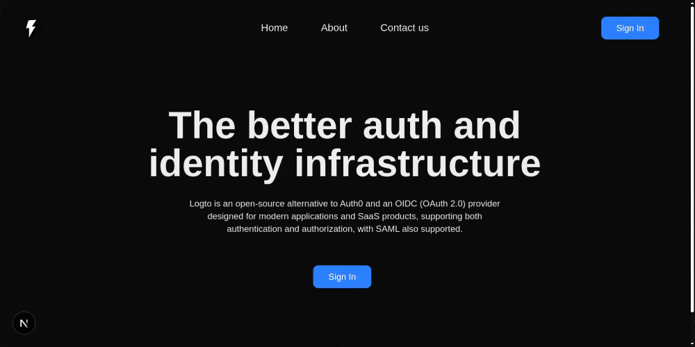

# How to Add Secure Auth to Your Next.js 15 Application Using Logto?
Quickly integrate Logto to Next.js 15 for Secure Authentication in under 5 Minutes.

---
[How to Add Secure Auth to Your Next.js App Using Logto?](https://medium.com/frontendweb/how-to-add-secure-auth-to-your-next-js-app-using-logto-ba68ebb1f680)
---

## Demo



## Getting Started

The first step is to clone the **logto-demo** project with a git command.

```bash
git clone https://github.com/officialrajdeepsingh/logto-demo

# change folder
cd logto-demo
```
The next step is to install the Node Package using the Node Package Manager.

```bash
pnpm install
# or
yarn install
# or
npm install
```

Lastly, run the development server:

```bash
npm run dev
# or
yarn dev
# or
pnpm dev
# or
bun dev
```

Open [http://localhost:3000](http://localhost:3000) with your browser to see the result.
